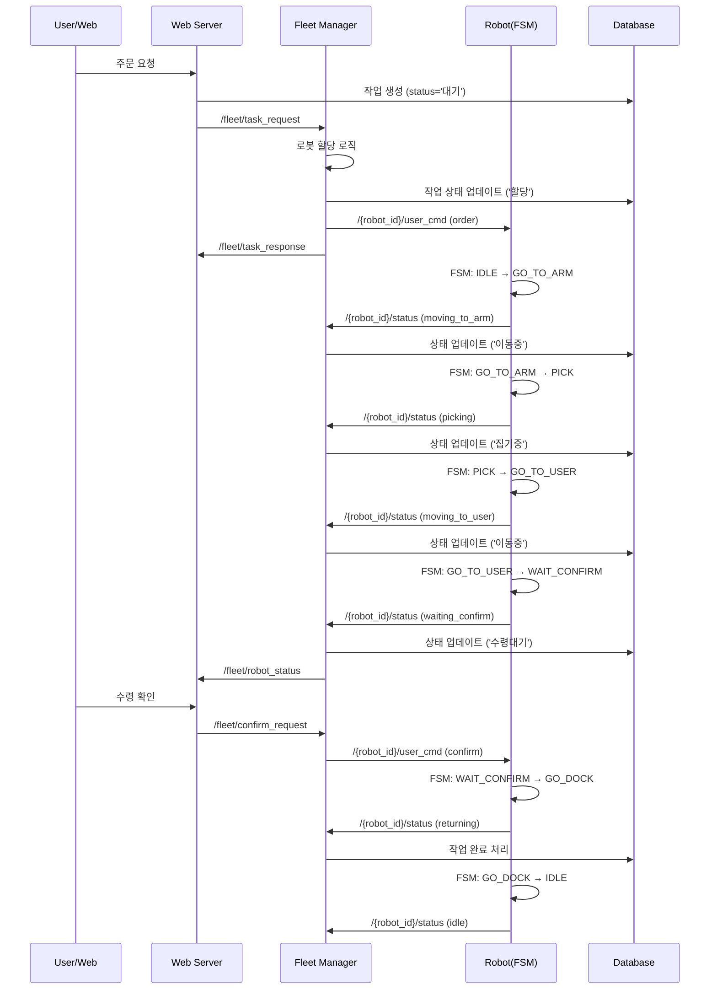
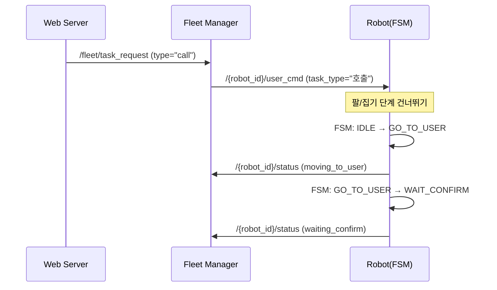

# E-Multi 로봇 플릿 관리 시스템 - ROS2 통신 인터페이스 매뉴얼

## 📋 목차
1. [시스템 개요](#시스템-개요)
2. [ROS2 도메인 아키텍처](#ros2-도메인-아키텍처)
3. [핵심 ROS2 토픽](#핵심-ros2-토픽)
4. [메시지 타입 및 데이터 구조](#메시지-타입-및-데이터-구조)
5. [통신 흐름 및 시퀀스](#통신-흐름-및-시퀀스)
6. [실제 사용 예제](#실제-사용-예제)

---

## 시스템 개요

E-Multi 시스템은 아파트나 주거용 건물에서 다중 배송 로봇을 관리하는 ROS2 기반 플릿 관리 시스템입니다.

### 주요 구성 요소

```
┌─────────────────────────────────────────────────────────┐
│                   중앙 서버 (Domain 129)                 │
├─────────────────────────────────────────────────────────┤
│  ┌──────────────┐  ┌─────────────┐  ┌──────────────┐  │
│  │  Web Server  │  │Fleet Manager│  │Domain Bridge │  │
│  │   (Flask)    │←→│   (ROS2)    │←→│   (Router)   │  │
│  └──────────────┘  └─────────────┘  └──────────────┘  │
│         ↓                  ↓                ↓          │
│  ┌──────────────────────────────────────────────────┐  │
│  │              PostgreSQL Database                 │  │
│  └──────────────────────────────────────────────────┘  │
└─────────────────────────────────────────────────────────┘
                            ↓
        ┌───────────────────┴───────────────────┐
        ↓                                       ↓
┌─────────────────┐                   ┌─────────────────┐
│ Robot 1         │                   │ Robot 2         │
│ (Domain 18)     │                   │ (Domain 19)     │
├─────────────────┤                   ├─────────────────┤
│ • Robot Node    │                   │ • Robot Node    │
│ • FSM Control   │                   │ • FSM Control   │
│ • Navigation    │                   │ • Navigation    │
└─────────────────┘                   └─────────────────┘
```

### 핵심 특징
- **멀티도메인 지원**: 각 로봇은 독립된 ROS2 도메인에서 실행
- **Domain Bridge**: 도메인 간 통신을 중계하는 브리지 시스템
- **중앙 관리**: Fleet Manager가 모든 로봇의 작업을 조정
- **DB 기반**: PostgreSQL로 작업 및 상태 관리

---

## ROS2 도메인 아키텍처

### 도메인 할당
```yaml
central_domain: 129  # Fleet Manager, Web Server
robot_1:
  domain_id: 18
  hana_bot_id: 8   # DB상의 로봇 ID
robot_2:
  domain_id: 19
  hana_bot_id: 9
```

### Domain Bridge 설정
Domain Bridge는 서로 다른 도메인 간의 통신을 중계합니다:

```yaml
# 자동 생성되는 bridge 설정 (/tmp/domain_bridge_config.yaml)
name: fleet_domain_bridge
topics:
  - topic: /robot_1/user_cmd
    type: std_msgs/msg/String
    from_domain: 129
    to_domain: 18
  - topic: /robot_1/status
    type: std_msgs/msg/String
    from_domain: 18
    to_domain: 129
```

---

## 핵심 ROS2 토픽

### 1. Fleet 레벨 토픽 (Domain 129)

| 토픽명 | 타입 | 방향 | 설명 |
|--------|------|------|------|
| `/fleet/task_request` | `String` | Web → Fleet Manager | 새 작업 요청 |
| `/fleet/task_response` | `String` | Fleet Manager → Web | 작업 응답 |
| `/fleet/robot_status` | `String` | Fleet Manager → Web | 로봇 상태 브로드캐스트 |
| `/fleet/confirm_request` | `String` | Web → Fleet Manager | 수령 확인 요청 |

### 2. Robot 레벨 토픽 (각 로봇 도메인)

| 토픽명 | 타입 | 방향 | 설명 |
|--------|------|------|------|
| `/{robot_id}/user_cmd` | `String` | Fleet Manager → Robot | 로봇 명령 |
| `/{robot_id}/status` | `String` | Robot → Fleet Manager | 로봇 상태 보고 |
| `/{robot_id}/confirm_request` | `String` | Fleet Manager → Robot | 확인 요청 전달 |
| `/{robot_id}/confirm_response` | `String` | Robot → Fleet Manager | 확인 응답 |

---

## 메시지 타입 및 데이터 구조

### 1. Task Request (Web → Fleet Manager)
```python
# /fleet/task_request
{
    "task_id": "12345",
    "task_type": "delivery",  # or "call"
    "resident_id": "9999",
    "items": [
        {
            "item_id": 1,
            "quantity": 2,
            "item_name": "생수"
        }
    ],
    "priority": 1
}
```

### 2. Task Response (Fleet Manager → Web)
```python
# /fleet/task_response
{
    "task_id": "12345",
    "status": "assigned",  # pending|assigned|in_progress|completed|failed
    "robot_id": "robot_1",
    "message": "Task assigned to robot_1"
}
```

### 3. Robot Command (Fleet Manager → Robot)
```python
# /{robot_id}/user_cmd
{
    "command": "order",  # or "confirm"
    "resident_id": "9999",
    "task_type": "배달",  # or "호출"
    "target_coordinates": [1.5, 2.3, 0.707],  # [x, y, orientation]
    "task_id": "12345"
}
```

### 4. Robot Status (Robot → Fleet Manager)
```python
# /{robot_id}/status
# 단순 문자열 상태
"idle"              # 대기 중
"moving_to_arm"     # 팔로 이동 중
"picking"           # 물건 집는 중
"moving_to_user"    # 사용자에게 이동 중
"waiting_confirm"   # 수령 확인 대기
"returning"         # 복귀 중
"navigation_failed" # 네비게이션 실패
```

### 5. Robot Status Broadcast (Fleet Manager → Web)
```python
# /fleet/robot_status
{
    "robots": {
        "robot_1": {
            "status": "busy",
            "current_task_id": "12345",
            "position": [1.0, 2.0, 0.0],
            "last_update": 1735123456.789
        },
        "robot_2": {
            "status": "idle",
            "current_task_id": null,
            "position": [0.0, 0.0, 0.0],
            "last_update": 1735123456.789
        }
    }
}
```

---

## 통신 흐름 및 시퀀스

### 1. 배달 작업 전체 시퀀스



### 2. 호출 작업 시퀀스 (물건 없이 이동)



### 3. 상태 동기화 프로세스

```python
# Fleet Manager의 상태 동기화 로직
def handle_robot_status(robot_id, status):
    if status == "moving_to_arm":
        update_db("이동중")
    elif status == "picking":
        update_db("집기중")
    elif status == "moving_to_user":
        update_db("이동중")
    elif status == "waiting_confirm":
        update_db("수령대기")  # 중요: 웹에서 확인 버튼 표시
    elif status == "returning":
        update_db("복귀중")
```

---

## 실제 사용 예제

### 1. ROS2 토픽 모니터링

```bash
# Fleet Manager 도메인에서 모니터링
export ROS_DOMAIN_ID=129

# 모든 fleet 토픽 확인
ros2 topic list | grep fleet

# 작업 요청 모니터링
ros2 topic echo /fleet/task_request

# 로봇 상태 모니터링
ros2 topic echo /fleet/robot_status
```

```bash
# Robot 1 도메인에서 모니터링
export ROS_DOMAIN_ID=18

# 로봇 명령 모니터링
ros2 topic echo /robot_1/user_cmd

# 로봇 상태 전송 모니터링
ros2 topic echo /robot_1/status
```

### 2. 수동 작업 전송

```bash
# 새 배달 작업 전송
ros2 topic pub --once /fleet/task_request std_msgs/String '{data: "{\"task_id\": \"test_001\", \"task_type\": \"delivery\", \"resident_id\": \"9999\", \"items\": [{\"item_id\": 1, \"quantity\": 2}]}"}'

# 로봇에 직접 명령 전송 (테스트용)
ros2 topic pub --once /robot_1/user_cmd std_msgs/String '{data: "{\"command\": \"order\", \"resident_id\": \"9999\", \"target_coordinates\": [1.5, 2.3, 0.707]}"}'

# 수령 확인 전송
ros2 topic pub --once /robot_1/user_cmd std_msgs/String '{data: "confirm"}'
```

### 3. 상태 확인 API

```bash
# 로봇 상태 확인
curl http://localhost:8080/robot_status/robot_1?resident_id=9999

# Fleet 전체 상태 확인
curl http://localhost:8080/fleet/status
```

### 4. 디버깅 및 문제 해결

```bash
# Domain Bridge 상태 확인
ps aux | grep domain_bridge

# Bridge 설정 확인
cat /tmp/domain_bridge_config.yaml

# ROS2 네트워크 상태 확인
ros2 doctor --report

# 특정 도메인에서 노드 확인
ROS_DOMAIN_ID=129 ros2 node list
ROS_DOMAIN_ID=18 ros2 node list
```

---

## 주의사항 및 팁

### 1. 도메인 설정
- 각 구성 요소는 올바른 도메인에서 실행되어야 함
- Domain Bridge가 실행 중인지 확인 필수

### 2. 메시지 포맷
- JSON 문자열로 전송되는 복잡한 데이터
- 상태는 단순 문자열로 전송
- 좌표는 PostgreSQL 배열 형식 `{x,y,z}` 또는 Python 리스트 `[x,y,z]` 지원

### 3. 실시간 동기화
- Fleet Manager가 로봇 상태를 DB에 즉시 반영
- `waiting_confirm` 상태가 '수령대기'로 매핑되는 것이 중요

### 4. 복구 메커니즘
- 시스템 재시작 시 자동으로 stuck 작업 복구
- 2분 이상 '할당' 상태인 작업은 자동으로 '대기'로 리셋

---

## 개발자를 위한 추가 정보

### 새 토픽 추가하기
1. `fleet_config.yaml`의 `bridge_topics`에 추가
2. Fleet Manager와 Robot Node에 publisher/subscriber 추가
3. Domain Bridge 재시작

### 새 로봇 추가하기
1. `fleet_config.yaml`에 로봇 설정 추가
2. 고유한 domain_id 할당
3. DB에 로봇 정보 등록
4. Domain Bridge 설정 재생성

### 성능 최적화
- 작업 할당 체크: 2초마다
- 타임아웃 체크: 30초마다
- 로봇 상태 heartbeat: 2초마다

---

이 매뉴얼은 E-Multi 시스템의 ROS2 통신 인터페이스를 이해하는 데 필요한 핵심 정보를 담고 있습니다. 추가 질문이나 개선 사항이 있으면 팀에 문의하세요.