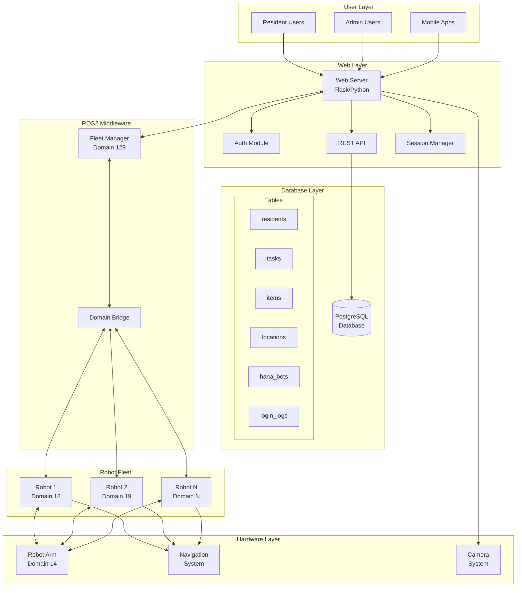
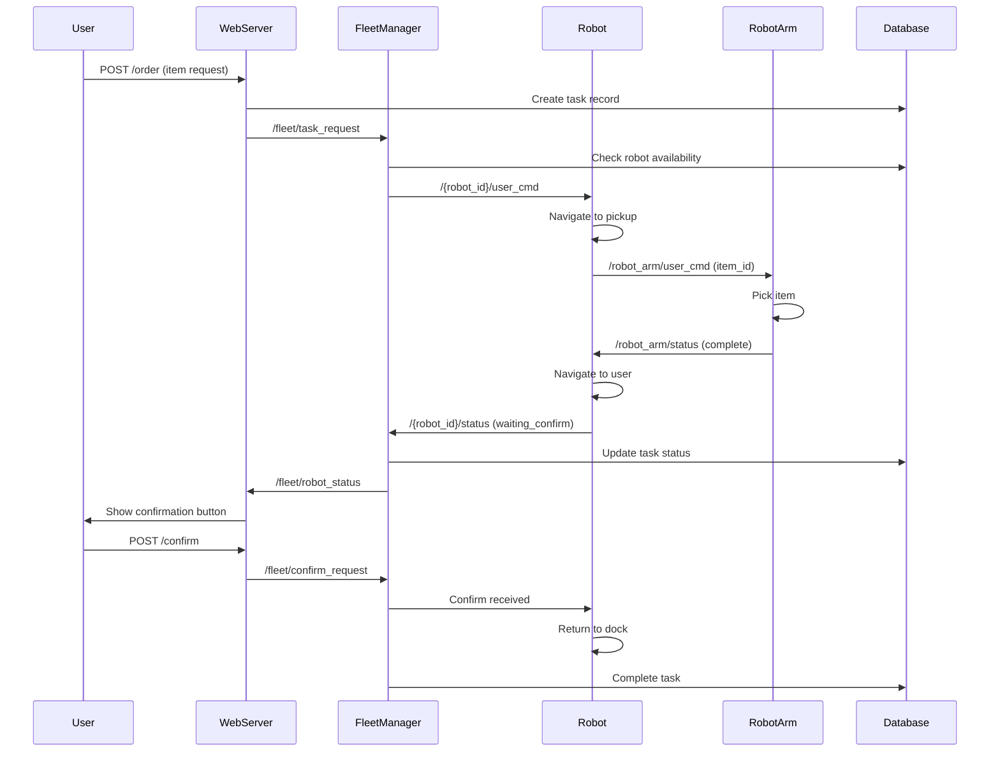

# Multi-Robot Fleet Management System Architecture

## System Components Diagram



## Data Flow Architecture



## Component Interaction Matrix

| Component | Communicates With | Protocol | Purpose |
|-----------|------------------|----------|---------|
| Web Server | Database | SQL/psycopg2 | Data persistence |
| Web Server | Fleet Manager | ROS2 Topics | Task coordination |
| Web Server | Camera System | OpenCV | Video streaming |
| Fleet Manager | Robots | ROS2 Topics | Command & control |
| Fleet Manager | Database | SQL | State synchronization |
| Robots | Robot Arm | ROS2 Topics | Item handling |
| Robots | Navigation | ROS2 Actions | Movement control |
| Domain Bridge | All Domains | DDS | Cross-domain routing |

## Domain Isolation Architecture

```
┌─────────────────────────────────────────────────────────┐
│                  Central Server (Domain 129)            │
│  ┌────────────┐  ┌──────────────┐  ┌────────────────┐ │
│  │ Web Server │  │Fleet Manager │  │  PostgreSQL    │ │
│  └────────────┘  └──────────────┘  └────────────────┘ │
└─────────────────────────┬───────────────────────────────┘
                          │ Domain Bridge
        ┌─────────────────┼─────────────────┐
        │                 │                 │
┌───────▼──────┐  ┌───────▼──────┐  ┌──────▼───────┐
│   Robot 1    │  │   Robot 2    │  │  Robot Arm  │
│  Domain 18   │  │  Domain 19   │  │  Domain 14  │
│              │  │              │  │             │
│ ┌──────────┐ │  │ ┌──────────┐ │  │ ┌─────────┐│
│ │   FSM    │ │  │ │   FSM    │ │  │ │Control  ││
│ ├──────────┤ │  │ ├──────────┤ │  │ ├─────────┤│
│ │Navigation│ │  │ │Navigation│ │  │ │Gripper  ││
│ ├──────────┤ │  │ ├──────────┤ │  │ ├─────────┤│
│ │  Sensors │ │  │ │  Sensors │ │  │ │Vision   ││
│ └──────────┘ │  │ └──────────┘ │  │ └─────────┘│
└──────────────┘  └──────────────┘  └─────────────┘
```

## Deployment Architecture

### Development Environment
```yaml
Single Machine Deployment:
  - All components on localhost
  - Single domain (129) or multi-domain with bridge
  - SQLite or local PostgreSQL
  - Simulated robots and arm
```

### Production Environment
```yaml
Distributed Deployment:
  Central Server:
    - Web Server (0.0.0.0:8080)
    - Fleet Manager (ROS2)
    - PostgreSQL Database
    - Domain Bridge
    
  Robot Machines:
    - Robot Node (ROS2)
    - Navigation Stack
    - Sensor Drivers
    - Local Config
    
  Robot Arm Station:
    - Arm Controller (ROS2)
    - Vision System
    - Safety Systems
```

## Network Architecture

```
                    Internet
                        │
                   [Firewall]
                        │
              ┌─────────┴─────────┐
              │   Load Balancer   │
              └─────────┬─────────┘
                        │
        ┌───────────────┼───────────────┐
        │               │               │
   [Web Server 1]  [Web Server 2]  [Web Server N]
        │               │               │
        └───────────────┼───────────────┘
                        │
                 [Message Queue]
                        │
                 [Fleet Manager]
                        │
              ┌─────────┴─────────┐
              │   Domain Bridge   │
              └─────────┬─────────┘
                        │
        ┌───────┬───────┼───────┬───────┐
        │       │       │       │       │
    [Robot 1] [Robot 2] [Arm] [Robot N] [...]
```

## State Management

### Task State Machine
```
    ┌──────┐
    │ 대기 │ (Pending)
    └───┬──┘
        │ Assign
    ┌───▼──┐
    │ 할당 │ (Assigned)
    └───┬──┘
        │ Start
    ┌───▼────┐
    │ 집기중 │ (Picking)
    └───┬────┘
        │ Move
    ┌───▼────┐
    │ 이동중 │ (Moving)
    └───┬────┘
        │ Arrive
    ┌───▼──────┐
    │ 수령대기 │ (Waiting)
    └───┬──────┘
        │ Confirm
    ┌───▼──┐
    │ 완료 │ (Completed)
    └──────┘
```

### Robot State Machine
```
    ┌──────┐
    │ IDLE │
    └───┬──┘
        │ Order
    ┌───▼────────┐
    │ GO_TO_ARM  │
    └───┬────────┘
        │ Arrived
    ┌───▼──┐
    │ PICK │────────┐
    └───┬──┘        │
        │       ┌───▼──────┐
        │       │ WAIT_ARM │
        │       └───┬──────┘
        │           │ Complete
    ┌───▼──────────▼┐
    │  GO_TO_USER   │
    └───┬───────────┘
        │ Arrived
    ┌───▼───────────┐
    │ WAIT_CONFIRM  │
    └───┬───────────┘
        │ Confirmed
    ┌───▼──────┐
    │ GO_DOCK  │
    └───┬──────┘
        │ Docked
    ┌───▼──┐
    │ IDLE │
    └──────┘
```

## Security Architecture

### Authentication Flow
```
User → Login → Web Server → Validate → Database
                  │                        │
                  └── Create Session ←─────┘
                            │
                      [Session Token]
                            │
                  All subsequent requests
```

### Authorization Levels
1. **Guest**: View only
2. **Resident**: Order, call, confirm own tasks
3. **Staff**: Monitor all tasks, manual control
4. **Admin**: Full system control, configuration

### Security Measures
- **Password**: Bcrypt hashing with salt
- **Session**: Server-side session storage
- **API**: Rate limiting and input validation
- **ROS2**: DDS security (optional)
- **Network**: HTTPS/TLS encryption
- **Database**: Connection pooling, prepared statements

## Performance Metrics

### Key Performance Indicators (KPIs)
- **Task Completion Rate**: > 95%
- **Average Delivery Time**: < 5 minutes
- **Robot Utilization**: > 70%
- **System Uptime**: > 99.9%
- **API Response Time**: < 200ms
- **Robot Response Time**: < 100ms

### Monitoring Points
1. Database query performance
2. ROS2 topic latency
3. Robot navigation accuracy
4. Task queue length
5. Error rates by component
6. Resource utilization (CPU, Memory, Network)

## Scalability Considerations

### Horizontal Scaling
- **Web Servers**: Load balanced instances
- **Robots**: Add more units with unique domains
- **Database**: Read replicas for queries

### Vertical Scaling
- **Fleet Manager**: Multi-threaded executor
- **Database**: Connection pooling, indexing
- **Domain Bridge**: Optimized routing tables

### Bottleneck Mitigation
- **Task Queue**: Priority-based scheduling
- **Robot Assignment**: Proximity-based allocation
- **Database**: Caching frequently accessed data
- **Network**: Local domain isolation